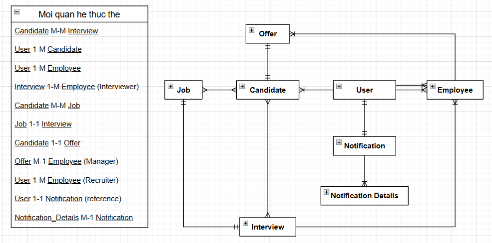

Interview Management System (IMS)  
🚀 Đây là dự án nhằm giúp cho quá trình tuyển dụng của công ty trở nên dễ dàng, tiện lợi và chuyên nghiệp hơn.  
🚀 Dự án thuộc về đội phát triển gồm 6 thành viên tại FSA.  
🚀 Công nghệ: Java, Spring Boot, Python.  
🚀 Database: MySQL.  

⭐ Thành viên:
- Trần Xuân Hoàn (HoanTX): Nhóm trưởng, chịu trách nhiệm thiết kế DB, làm rõ nghiệp vụ hệ thống, phân chia, quản lý công việc, đôn đốc các thành viên hoàn thành nhiệm vụ;
Hướng dẫn các thành viên mới làm quen với công nghệ; Phân quyền, ủy quyền và thiết kế hệ thống thông báo;
Thiết lập cơ chế đa ngôn ngữ (các văn bản tĩnh), gửi thông báo nhắc hẹn tự động cho phía Interview.
- Phạm Đức Long (LongPD): Thiết kế DB, xây dựng các chức năng về Offer, tạo chat bot và hệ thống nhắn tin nội bộ, tạo nhắc hẹn tự động cho phía Offer.
- Ngô Thu Trang (TrangNT): Phát triển các chức năng liên quan đến User.
- Trần Đăng Vũ (VuTD): Phát triển các chức năng liên quan đến Interview; Thiết kế giao diện trang web và tạo thông báo.
- Nguyễn Nam Phong (PhongNN): Phát triển các chức năng của Job.
- Phạm Hải Đăng (DangPH): Phát triển các chức năng của Candidate và tạo thông báo

⭐ Thời gian:
Từ 20/1-9/4

